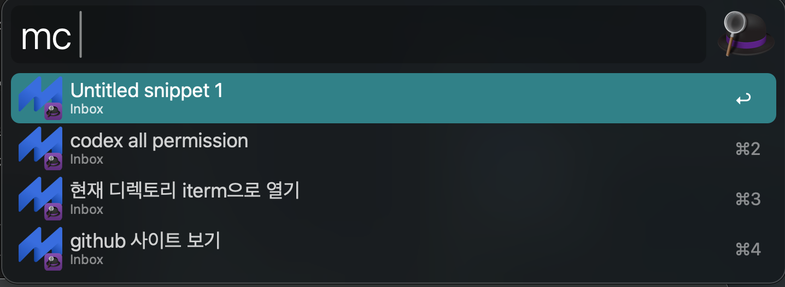
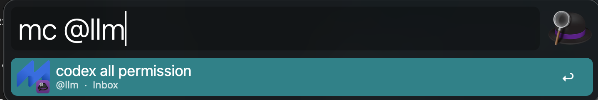

# MassCode Search for Alfred

Search your [massCode](https://masscode.io/) snippets from Alfred and paste them straight into the focused app — no clicking through the snippet manager.





## Features

- Search snippets by name with the `mc` keyword
- Filter by tag using `@tagname` (e.g. `mc @llm prompt`)
- Tab-autocomplete tag names — type `mc @` to see all available tags
- `Enter` copies the snippet contents to the clipboard
- `Alt + Enter` opens the snippet directly in massCode

## Requirements

- [Alfred](https://www.alfredapp.com/) with the **Powerpack** (required for Script Filters)
- [massCode](https://masscode.io/) v3+ with the **REST API enabled** (Preferences → Storage → REST API)
- Node.js 18+ (built-in `fetch` is required)

## Installation

1. Download the latest `.alfredworkflow` file from the [Releases](../../releases) page.
2. Double-click it to import into Alfred.

Or, to install from source:

```sh
git clone https://github.com/harryhan24/masscode-search-for-alfred.git
# then in Alfred: drag the folder into the Workflows list, or symlink it into
# ~/Library/Application\ Support/Alfred/Alfred.alfredpreferences/workflows/
```

## Configuration

Open **Alfred Preferences → Workflows → MassCode Search → Configure Workflow…** to set:

| Setting | Default | Description |
| --- | --- | --- |
| **massCode Port** | `4321` | Port that the massCode REST API is listening on |

### Node path

The workflow calls Node at `/opt/homebrew/bin/node` (Homebrew on Apple Silicon). If you use a different setup, edit the **Script Filter**'s script field in Alfred:

- Intel Mac (Homebrew): `/usr/local/bin/node index.mjs "$1"`
- nvm / fnm / asdf: use the absolute path printed by `which node`

## Usage

| Input | Result |
| --- | --- |
| `mc` | List all snippets |
| `mc react` | Snippets whose name contains `react` |
| `mc @` | Tag picker (autocomplete) |
| `mc @llm` | Snippets tagged `llm` |
| `mc @llm prompt` | Snippets tagged `llm` whose name contains `prompt` |

Then:

- `↵` — copy snippet contents to clipboard
- `⌥ + ↵` — open snippet in the massCode app

## How it works

`index.mjs` is a single-file Node script (no `node_modules`, no build step) that hits the massCode REST API at `localhost:<port>/snippets` and `/tags`, then prints an Alfred Script Filter JSON document to stdout. The port is read from the `masscode_port` env var that Alfred injects from the workflow's user configuration.

## License

TBD — add a `LICENSE` file before publishing.
